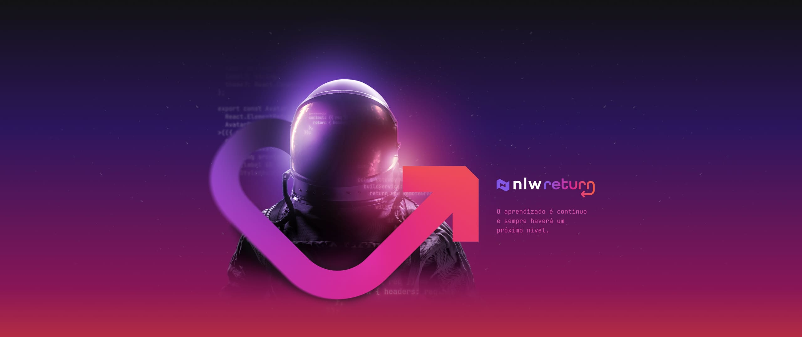

# NLW-Return

  <a href="#trilha-origem">Origin &nbsp;&nbsp;&nbsp;|&nbsp;&nbsp;&nbsp;
  <a href="#impulse">Impulse 

  

## Trilha Origin

  <a href="#tecnologias">Tecnologias</a>&nbsp;&nbsp;&nbsp;|&nbsp;&nbsp;&nbsp;
  <a href="#projeto">Projeto</a>&nbsp;&nbsp;&nbsp;|&nbsp;&nbsp;&nbsp;
  <a href="https://doctorcare-nlw.netlify.app/">Link

<a href="https://doctorcare-nlw.netlify.app/">:link: Acessar a página </a>

  

##Tecnologias
* HTML
* CSS
* JavaScript
* ScrollReaveal
* Deploy no Netlify

##Projeto:
Landing page institucional responsiva

---

